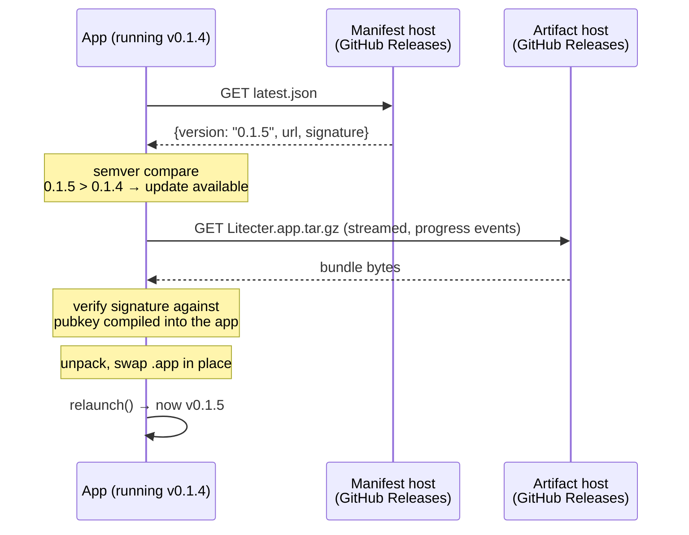
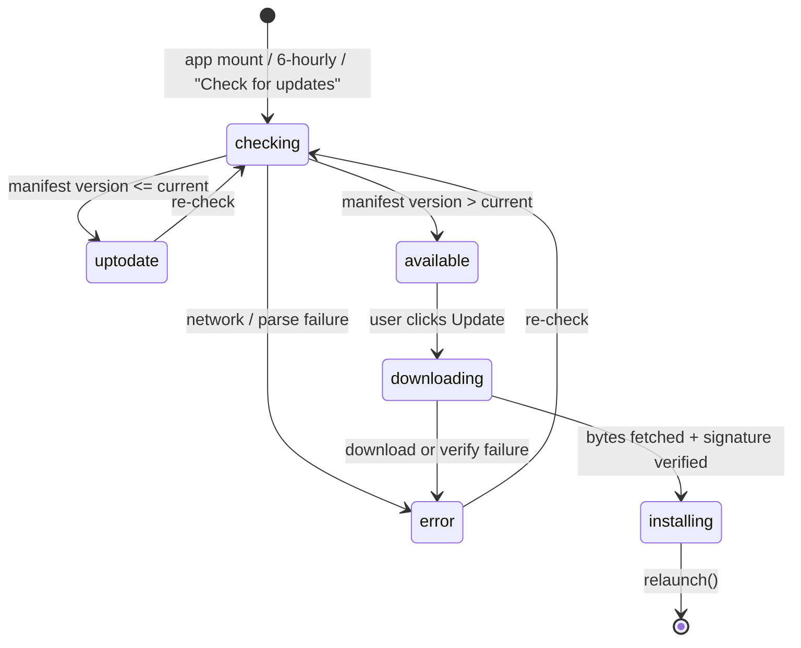

# One-click in-app updates

How a running copy of Litecter notices a new version and installs it with a
single click.

**Companion doc.** This is the *consumer* half — what the app does. The
*producer* half — how CI builds, signs, notarizes and publishes the release the
app updates to — is [docs/release-pipeline.md](release-pipeline.md), and this
doc defers to it for anything CI-side: job structure, the Apple signing chain,
the secrets table, and the failure playbook.

The update backend is **GitHub Releases**. No extra infrastructure.

---

## The shape of the thing

Four moving parts, and the whole design falls out of them:

| Part | Litecter's choice | What it does |
|---|---|---|
| **Update manifest** | `latest.json` on the GitHub "latest" release | A small JSON file the app polls: what the newest version is, and where its bundle lives |
| **Update artifact** | `Litecter.app.tar.gz` + `.sig` | The new app, compressed, plus a detached signature |
| **Signing keypair** | minisign keypair from `tauri signer generate` | Private key lives in CI secrets and signs the artifact; public key is compiled into the app and verifies it |
| **Client** | `@tauri-apps/plugin-updater` + `plugin-process` | Fetches manifest → compares semver → downloads → verifies → swaps bundle → relaunches |

The security property that makes one-click safe: **the app only installs bytes
signed by a key we control.** A hijacked release asset or a MITM on the download
still can't ship code to users, because the signature check happens client-side
against a pubkey baked into the running binary.



### Two signing chains, don't conflate them

A signed-and-notarized macOS app still needs a *second*, independent key for
updates:

- **Apple Developer ID + notarization** — makes the *installer* (`.dmg`) open
  without a Gatekeeper warning. Apple's chain, Apple's cert, shared across every
  app on the team.
- **Updater signing key (minisign)** — makes the *in-app update* trustworthy.
  Ours, generated once, **per app**, unrelated to Apple.

Both are required. The updater key is the one that must never be lost: losing it
strands every installed copy on its current version permanently, because they
only accept artifacts signed by the pubkey they were built with.

---

## Client state machine

Six phases. Every UI affordance is a function of the current phase, which keeps
the view dumb.



- `checking` — querying the manifest
- `uptodate` — no newer release
- `available` — newer release exists, not yet installing (carries version + notes)
- `downloading` — fetching + verifying (carries `progress ∈ [0,1]`)
- `installing` — bundle swapped, about to relaunch
- `error` — carries a human-readable reason

## UX rules

1. **Check quietly on launch.** No modal, no "you're up to date!" popup. A
   silent check on mount, folded into an existing surface.
2. **Re-check every 6 hours.** Litecter lives in the menu bar for weeks at a
   time; a launch-only check would mean a long-running copy never learns about a
   release. The re-check only fires from `uptodate` or `error`, so it can never
   interrupt a download or clear an update the user has already been offered.
3. **The one click is literally one click.** The button reads *"Update to v0.1.5
   & Restart"* — it names the version and it promises the restart. Clicking it
   downloads, verifies, installs and relaunches with no further prompts.
4. **Surface availability passively.** A small dot on the settings gear. The
   user discovers the update when they happen to look, and is never interrupted.
5. **Progress in place.** The same row becomes `Downloading… 43%` with a thin
   progress bar under it. No separate window.
6. **Always show the current version.** A subtle status line: `v0.1.5 · Up to
   date`, `Current: v0.1.4` when an update is pending, `Restarting…` while
   installing.
7. **Always offer the manual escape hatch.** On `error`, a *"Download manually…"*
   item opens the releases page in the browser. Auto-update *will* fail for
   someone (corporate proxy, read-only install location, disk full) and a dead
   end is the worst outcome.
8. **Manual re-check is always reachable** — the same row is a *"Check for
   updates"* button in `uptodate` / `error`, disabled while `checking`.

## The UI

Everything lives in the **settings modal** (the ⚙ in the header), under an
`Updates` section — no dedicated dialog, no tray menu item.

```
┌─────────────────────────────────┐
│ Daily digest hour          09:00│
│ Launch at login              [x]│
│ UPDATES                         │
│ ↓ Update to v0.1.5 & Restart    │  ← phase: available
│ ▓▓▓▓▓▓▓░░░░░░░░░░░              │  ← phase: downloading
│ Current: v0.1.4                 │  ← status line, always present
│ Download manually…              │  ← phase: error only
└─────────────────────────────────┘
  ⚙•                                 ← gear + badge dot
```

The single row is a three-way switch on phase:

| Phase | Row renders as |
|---|---|
| `available` | Primary-styled button, `Update to v{latest} & Restart`, tooltip = release notes |
| `downloading` / `installing` | Non-interactive row: `Downloading… 43%` / `Installing…`, `aria-live="polite"` |
| everything else | `Check for updates` button (label `Checking…` + disabled while checking) |

The status line beneath it is derived straight from the phase. The gear's badge
dot lights on `phase === "available"` and its `aria-label` becomes
`Settings — update available`.

---

## Files

| File | Role |
|---|---|
| [app/src/updater.ts](../app/src/updater.ts) | The whole client state machine, as a module-level Svelte store |
| [app/src/Prefs.svelte](../app/src/Prefs.svelte) | The Updates section of the settings modal |
| [app/src/App.svelte](../app/src/App.svelte) | Starts the watch on mount; badge dot on the gear |
| [app/src/api.ts](../app/src/api.ts) | `openExternal` — the manual-download fallback |
| [app/src-tauri/tauri.conf.json](../app/src-tauri/tauri.conf.json) | `plugins.updater` (pubkey + endpoint), `bundle.createUpdaterArtifacts` |
| [app/src-tauri/capabilities/default.json](../app/src-tauri/capabilities/default.json) | `updater:default`, `process:default` |
| [app/src-tauri/src/main.rs](../app/src-tauri/src/main.rs) | Registers both plugins under `#[cfg(desktop)]`; `open_external` command |
| [.github/workflows/release.yml](../.github/workflows/release.yml) | Bump → build → sign → notarize → manifest → publish |

### Why a store and not a component

State lives in a module-level store rather than in `Prefs.svelte`, because the
settings modal is unmounted most of the time but the gear's badge has to know
about a pending update whether or not that modal has ever been opened. The
`Update` handle that `check()` returns is kept in a module-level variable, *not*
in the store — `install()` needs that exact object, and the store holds only
what the view renders.

Progress is accumulated manually: the `Progress` event carries a *chunk* length,
not a running total, so chunks are summed against the `contentLength` from
`Started`. `contentLength` can be absent on a chunked response, hence the
`total ? done / total : 0` guard.

## Configuration

`app/src-tauri/tauri.conf.json`:

```json
{
  "plugins": {
    "updater": {
      "pubkey": "dW50cnVzdGVkIGNvbW1lbnQ6IG1pbmlzaWduIHB1YmxpYyBrZXk6…",
      "endpoints": [
        "https://github.com/boat-builder/litecter/releases/latest/download/latest.json"
      ]
    }
  },
  "bundle": { "createUpdaterArtifacts": true }
}
```

`createUpdaterArtifacts: true` is what makes `tauri build` emit the
`.app.tar.gz` + `.sig` alongside the `.dmg`. With it on, the build **fails**
unless `TAURI_SIGNING_PRIVATE_KEY` is present — a good failure, it means a
release can't accidentally ship with no updater artifact.

Both plugins are permission-gated in `capabilities/default.json`:

```json
{ "permissions": ["core:default", "updater:default", "process:default"] }
```

Miss `process:default` and the update installs but the relaunch throws, leaving
the user on the old version until they quit manually.

## Manifest format

```json
{
  "version": "0.1.5",
  "notes": "Automatic update to Litecter v0.1.5. See the releases page for details.",
  "pub_date": "2026-08-13T09:14:02Z",
  "platforms": {
    "darwin-aarch64": {
      "signature": "<contents of the .sig file, inline>",
      "url": "https://github.com/boat-builder/litecter/releases/download/v0.1.5/Litecter.app.tar.gz"
    }
  }
}
```

- `version` — bare semver, no `v` prefix. Compared against the running app's version.
- `notes` — surfaced to the user as the update button's tooltip.
- `platforms` keys are `{target}-{arch}`. Litecter ships `darwin-aarch64` only.
- The manifest is served from a *stable* URL (`releases/latest/download/...`),
  but the `url` inside it points at the *pinned tag* — so a manifest can never
  hand out a mismatched artifact.

---

## Verifying it works

The check that actually matters is an end-to-end one, and it can only be done
with two real releases:

1. Install the `.dmg` from release N into `/Applications`.
2. Merge anything to `main` to cut release N+1.
3. Open the installed copy: within a few seconds the gear should show its dot,
   and **Settings → Updates** should offer *Update to vN+1 & Restart*. Click it;
   the app should relaunch reporting the new version.

Test the failure path too — point the endpoint at a 404 and confirm the app
lands in `error` with the manual-download fallback rather than hanging.

Sanity-check the manifest by hand at any time:

```bash
curl -sL https://github.com/boat-builder/litecter/releases/latest/download/latest.json | jq
```

An update run from a dev build (`npm run tauri dev`) is not a meaningful test:
the dev binary's version and install location differ from a shipped one.

## Gotchas worth knowing up front

- **Version drift is the #1 cause of "update does nothing."** If the binary
  reports a different version than the manifest advertises, the result is either
  no update or a permanent update loop. That is why the `bump` job stamps five
  files and asserts after each.
- **The app must be able to write its own bundle.** An app run from inside a
  mounted `.dmg`, or installed somewhere the user can't write, fails at the swap
  step. This is the most common real-world `error` phase — hence the mandatory
  manual-download fallback.
- **A wrong `platforms` key fails silently.** `darwin-aarch64` vs
  `darwin-x86_64` — the app doesn't error on a manifest with no entry for its
  triple, it just reports "up to date" forever. That silence is also how Intel
  stays retired: old universal installs simply stop seeing updates rather than
  breaking.
- **Losing the private key is unrecoverable.** Back it up outside CI.
- **The pubkey and the CI private key must be a pair.** Mismatched, every
  download reaches 100% and then fails verification.
