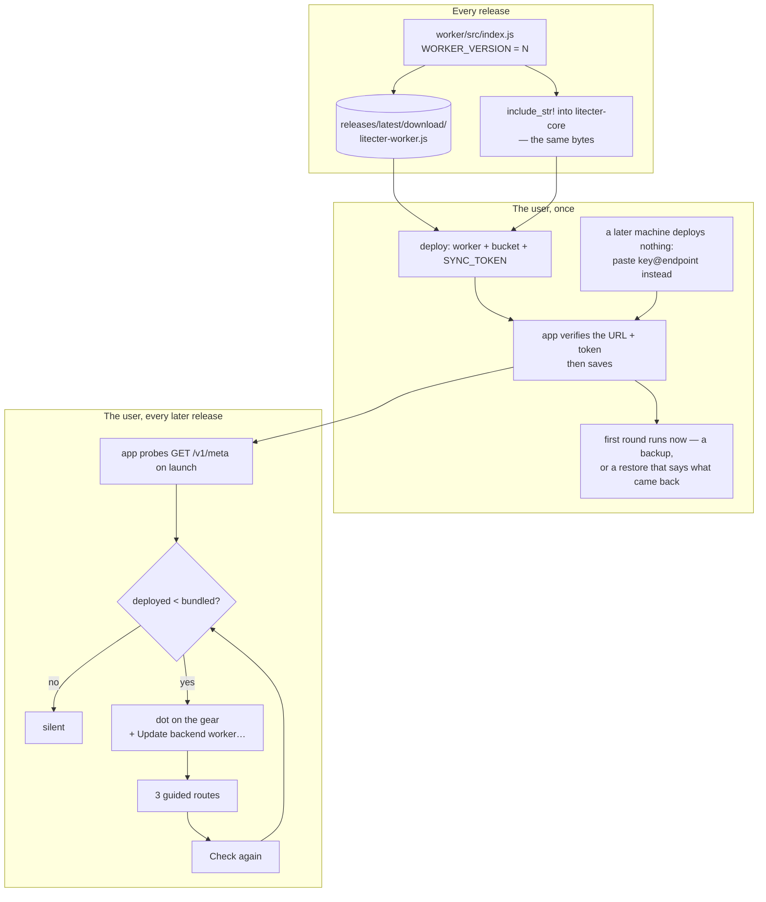
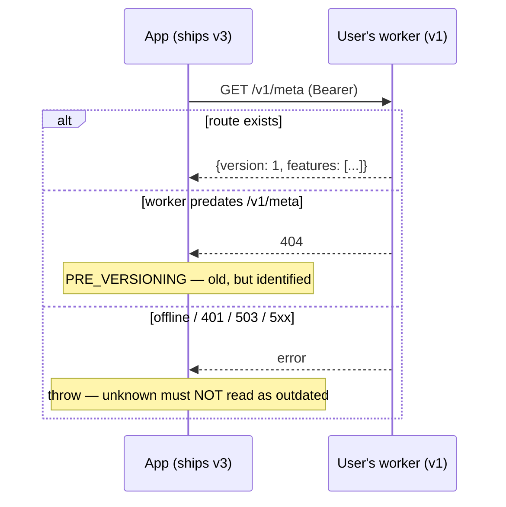

# The backend users deploy

Litecter has a backend and does not run one. Each user deploys
[`worker/src/index.js`](../worker/src/index.js) to their own Cloudflare account,
pastes the URL into the app, and that is the whole service. No accounts, no
per-user storage bill, no data custody, no scaling.

That trade buys a great deal and costs exactly one thing: **we can never deploy
anything again.** Every constraint below falls out of that.

| Constraint | What it forces |
|---|---|
| The app holds the backend's data token, never the user's Cloudflare credentials | An update can only be *guided*. Every path is instructions plus verification, never an API call |
| Users range from "never opened a terminal" to "lives in one" | More than one deploy route, and at least one needing no toolchain |
| Deployments drift — a v1 worker stays live while the app reaches v9 | The app must detect drift, and old backends must degrade legibly |
| We are asking for a paste into someone's own cloud account | What we hand over stays readable, minimal-scope, and honest about what it touches |

This is the same shape as [Doklin's user-deployed
backends](https://github.com/boat-builder/doklin/blob/main/docs/self-hosted-backend-flow.md),
ported. Where Litecter diverges, it says so and why.

## The loop



**The version number is the whole protocol.** Everything else is delivery.

## The five invariants

### 1. One version number, and the app *parses* it

`worker/src/index.js` owns a single integer. Nothing in the Rust or Svelte
declares "the latest worker is 3" — `litecter-core` `include_str!`s the worker
and reads the constant back out with a regex. A worker bump therefore reaches
the app in the same commit, automatically, and the two cannot drift apart.

An unparseable version yields `None`, which **disables the nag** rather than
inventing a number. `sync::worker::parse_version` and its tests are the whole
mechanism; CI asserts the constant is greppable as well.

### 2. The worker is one file, at a stable URL

```
https://github.com/boat-builder/litecter/releases/latest/download/litecter-worker.js
```

**Litecter has no bundler here, and that is the notable divergence.** Doklin's
worker embeds a compiled frontend, so it must run a vite lib build and ship the
bundle. Litecter's worker is ~200 lines with no dependencies and no assets, so
the file *is* the artifact: the release copies it verbatim, `include_str!` reads
the same bytes, and the "copy worker code" button hands over the same bytes
again. One less pipeline to keep honest.

It stays plain JavaScript rather than TypeScript for the same reason — the
dashboard route pastes it as-is. Types come from JSDoc under `checkJs`, so CI
still catches a broken deploy.

Point at `latest`, deliberately: a newer worker always works with an older app
(invariant 5), so someone who deploys today and updates Litecter next month is
fine.

### 3. Three routes, one artifact

| Route | For | Needs | Artifact |
|---|---|---|---|
| **Browser** | anyone | a browser | the code bundled into the app — a *Copy worker code* button |
| **AI agent** | anyone with a coding agent | an agent with shell access | a generated prompt that `curl`s the release URL |
| **Terminal** | developers | node + wrangler | the release URL plus commands |

The browser route is the one that is easy to skip and the most important to
keep. It is the only route that works with nothing installed, and it is the
*fastest* for everyone: paste, Deploy, done.

Two properties make it work, and both are worth protecting:

- **A code-only swap preserves everything else.** Pasting new code over an
  existing Worker in the dashboard keeps its bucket binding, its secrets and its
  custom domain. That is what turns "update the backend" into one paste.
- **The pasted code stays readable.** No minification. We are asking someone to
  trust-paste this into their own cloud account.

All three are generated in `sync::setup`, in Rust, so the CLI and the app cannot
disagree about what to do.

### 4. No cloud credentials — so honesty is the interface

The app holds one secret: the bearer token the worker checks. It cannot list the
user's Workers, cannot deploy, cannot see the account. So every route ends in
verification *from our side*:

- Setup ends at `Connection::verify`, which calls `/v1/meta` and refuses to save
  unless the answer looks right. "The instructions said it worked" is not
  evidence.
- Update ends at **Check again**, which re-probes and reports the live version.

**Litecter's token is derived, not generated separately.** The sync key already
produces `blake3_derive("litecter sync auth v1", key)`; that hex string is what
goes into `SYNC_TOKEN`. So a restore on a second machine needs no new secret —
the same key that decrypts the backup also authenticates to it.

The corresponding rule: **the update path carries no secret.** A same-name
redeploy leaves `SYNC_TOKEN` untouched, so update prompts and scripts contain
nothing sensitive and can be pasted anywhere. Setup's agent and terminal routes
*do* carry the token, and the UI says so at the copy button —
`Route::setup_carries_secret` drives that label, and a test pins the pairing so
a prompt cannot start carrying a secret without the label following.

### 5. The API only grows, and old backends fail legibly

A user's deployment can be arbitrarily old. That is normal.

- **New worker + old app** must always work. Never repurpose a field; add.
- **Old worker + new app** must produce something the UI can route on. A 404 on
  `/v1/meta` is `PRE_VERSIONING` — a *positive identification* of an old
  deployment, not a failure.
- `features: [...]` ships alongside the version so the app can ask "can it do X"
  without memorising version history.

**Bump the version even when nothing about the API changed.** The version is the
rollout mechanism; a fix that does not bump it never arrives.

## The handshake



Three states, and the third is the one people get wrong: **unknown is not
outdated.** A failed probe leaves the version unjudged, or every user on a plane
gets nagged to redeploy a worker that was already current.

`/v1/meta` sits **behind auth**, in the same block as everything else. It then
doubles as a credential check, and it cannot be used to fingerprint deployments
from outside.

### Where the drift shows up

| Surface | Behaviour |
|---|---|
| Launch probe | One `/v1/meta`, off the startup path. Failures swallowed |
| Settings gear | A dot when the backend is behind |
| Settings → Backup | The versions, plainly, with *Update backend worker…* |
| Update dialog | A card reading `v1 → v3` with its own **Check again**, which flips to **Updated ✓** rather than vanishing |
| `litecter sync status` | The same line, so a headless daemon is not silent |

That last dialog detail is worth keeping: a row that disappears the moment it
succeeds reads as a bug. The dialog snapshots the version when it opens rather
than driving off live state.

None of this blocks anything. The wording throughout is "backups keep working
meanwhile" — because they do, and a modal implying breakage over a backend that
is merely behind is a lie that costs trust.

## Writing the hand-offs

The instructions are the product. Two rules, in `sync::setup`:

**Verify before you mutate.** The endpoint reveals the worker's name only when
it is a `workers.dev` URL (the name is the first label). Behind a custom domain
the app is *guessing* from a convention. So a guess is marked as a guess in the
UI and in the prompt; the agent prompt says to confirm against the account and
to **ask rather than invent**; and the generated script, which cannot ask,
**refuses** — it checks the name and exits with which line to correct.

**Name the specific failure.** The hazards here are asymmetric and non-obvious,
and every prompt spells them out:

- A deploy under a *wrong* name does not error. It silently creates a **second**
  worker while the real one keeps serving old code. The agent prompt includes
  the cleanup command.
- A deploy under a name belonging to something *else* silently overwrites it.
- A redeploy whose `wrangler.toml` omits `[[r2_buckets]]` **removes the
  binding** — wrangler treats the file as the whole truth. So
  `Deployment::wrangler_toml` always restates the binding, and restates the
  custom domain too when the endpoint is not a `workers.dev` URL.
- A redeploy with the *wrong* bucket name points the backup at an empty bucket.
  The old one is orphaned rather than deleted, so nothing looks broken. The
  prompt says to check with `wrangler r2 bucket list`.

And one that comes free: setup's prompt ends by telling the agent to print
exactly `ENDPOINT: <url>` — one line to copy into a form the app then verifies.

## What Litecter does *not* port

Doklin supports several backends at once, which forces domain-derived naming,
owner-vs-member roles, and per-connection cards. Litecter has exactly one
backup, so all of that collapses: one endpoint, one key, one card. If a second
connection ever becomes a thing, that section of Doklin's doc is the map.

Teardown is also simpler. Doklin needs a batched `POST /api/admin/wipe` because
its bucket holds many objects; Litecter's holds one, so `DELETE /v1/blob` is the
whole thing. The order still matters, and Settings → Backup follows it: erase
the data through the app (R2 will not delete a non-empty bucket, and nothing but
the app holds the token), then remove the Worker and bucket, then disconnect.

## Per-app knobs

Everything you would change to lift this into another app, in one list: the
worker/bucket **naming convention** (`sync::worker::DEFAULT_*`), the **binding
name** (`SYNC`), the **secret name** (`SYNC_TOKEN`), the **asset filename**, the
repo in `RELEASE_URL`, the `compatibility_date` in every generated
`wrangler.toml`, the **verification request** (`/v1/meta`), and where the
credentials live (Litecter's `settings` table).

## Failure modes worth designing against

| Failure | Why | The answer |
|---|---|---|
| A second worker appears; the real one still serves old code | Deployed under a name that does not exist — this does not error | Verify names first; the agent asks, the script refuses |
| A working backend goes dark after an update | The redeploy config omitted the bucket binding | `wrangler_toml` always restates it; a test pins that |
| The backup silently starts over | Redeployed against the wrong bucket name | Prompts say to check, and name the symptom (nothing looks broken) |
| Users nagged about a current worker | A failed probe read as "outdated" | Probe failure throws; unknown stays unknown |
| The badge never clears after a redeploy | Dialog driven off live state; the row vanished mid-flow | Snapshot on open; recheck flips the card to **Updated ✓** |
| A working backend answers 503 after an update | A pre-versioning deployment has no `SYNC_TOKEN` | `needs_token_secret()` adds the extra step to all three routes |
| A frontend-only fix never reaches deployments | No API change, so no version bump | Bump for invisible changes too — the version *is* the rollout |
| Setup succeeds but nothing works | Trusted "done" | Verify from the app before saving, and again on **Check again** |
| A second machine deploys a *second* backend | Restoring was a footer link under three deploy routes | *Restore an existing backup…* sits beside *Set up backup*, and skips the routes entirely |
| A user follows a 401 into stranding their own backup | One message for a code that means two things | `Intent` splits it: connecting is pointed at restore first, adopting is told its paste is wrong |

## The agent prompt, generically

Both prompts follow one skeleton. Filled in for a new app, it is a working
hand-off:

1. **The goal in one sentence**, naming the target and what must survive.
2. **Fetch the artifact** — one `curl` of the stable URL, with a clone fallback.
3. **Establish credentials** — `whoami`, and if not logged in, `login` plus
   *"ask me to complete the sign-in in the browser window it opens."*
4. **Verify identity before mutating** — check the name against the account;
   where the app guessed, say so and say *"ask me rather than substituting a
   name you invented."*
5. **The config file, verbatim**, with the fill-ins marked. Never in prose.
6. **Deploy, with the failure named** — what a wrong outcome looks like
   concretely, and the exact command that undoes it.
7. **Verify, and one line back** — an HTTP check the agent runs itself, then
   *"print exactly this line, filled in."*

Close with the negative scope: *"Do not commit `wrangler.toml` anywhere, and do
not create or modify any other resources."* And say at the copy point whether
the prompt carries a secret — setup's does, update's does not, and the user
deserves to know which one they are pasting.

## Other stacks

Nothing above is Cloudflare-specific except the resource nouns. Version constant
→ meta route → bundled-code comparison → three guided routes → verify from the
app ports unchanged to any target with a CLI and a dashboard. What you would
rewrite is the generated config, the CLI invocations inside the prompts, and the
rule mapping an endpoint back to a deployment name.
